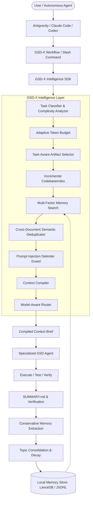

<div align="center">

# GSD-X

**GSD, with a smarter memory and context engine.**

**English** · [Português](README.pt-BR.md) · [简体中文](README.zh-CN.md) · [日本語](README.ja-JP.md) · [한국어](README.ko-KR.md)

GSD, redesigned for a 67.5% aggregate token reduction across benchmark scenarios, with individual task savings reaching up to 83.0%. Smart memory, intelligent context compression, adaptive token compilation, and code indexing for faster, more efficient long-running AI coding agents.

[](https://www.fiverr.com/codee_studio)
[](https://www.fiverr.com/codee_studio)
[](https://t.me/kblautosignals)
[](https://www.typescriptlang.org/)
[](tests/)
[](docs/BENCHMARKS.md)
[](LICENSE)

</div>

---

> [!NOTE]
> **Fork & Lineage Notice**: GSD-X is an independent fork and architectural evolution of [Open GSD Core](https://github.com/udaydeep1992/gsd-x). It is not officially affiliated with or endorsed by the original GSD / Open GSD maintainers. GSD-X preserves full backward compatibility with upstream `.planning/` workflows while introducing a local-first memory and context intelligence layer.

---

## The Core Problem: Context Bloat & Amnesia

Naïve AI coding agents suffer from the **Additive Context Fallacy**:
$$\text{Naive Context} = \text{System Prompt} + \text{Chat History} + \text{All Planning Docs} + \text{Retrieved Memories} + \text{All Code Files}$$

This approach leads to:
1. **Severe Token Inefficiency**: Costs explode by 300% to 500% as projects grow.
2. **Context Degradation & Amnesia**: LLM attention degrades when saturated with thousands of lines of irrelevant specs.
3. **Instruction Drift**: Stale planning notes conflict with active implementation details.

### The GSD-X Design Principle

> **MEMORY MUST REPLACE REDUNDANT CONTEXT, NOT SIMPLY ADD MORE CONTEXT.**

Instead of blindly injecting everything, GSD-X runs a deterministic context compilation pipeline:
```
TASK INTENT
    │
    ▼
[Task Classifier] ───► Classifies task complexity & allocates adaptive token budget
    │
    ▼
[Omission Filter] ───► Filters out 70-90% of unrelated project documents
    │
    ▼
[Symbol Indexer]  ───► Extracts 10-line signatures & docstrings instead of 500-line files
    │
    ▼
[Memory Engine]   ───► Injects 25-token distilled decisions to replace bulky docs
    │
    ▼
[Deduplicator]    ───► Collapses identical constraints repeated across files
    │
    ▼
COMPILED CONTEXT (Minimal tokens, maximal signal)
```

---

## Architecture



---

## Measured Benchmark Results: Up to 83.0% Fewer Tokens

> **67.5% aggregate token reduction across eight benchmark scenarios, with individual task savings reaching up to 83.0%. Measured benchmark cost reduction is 33.0% under Fable 5 pricing.**

All figures below are from our automated, reproducible benchmark harness (`benchmarks/run-benchmark.cjs`) comparing upstream Open GSD Core against GSD-X across 8 standardized software development scenarios on commit `13d37238ba08377929e4850fd6ae4b8db49a22ca`. Canonical data is recorded in [`benchmarks/data/benchmark_results.json`](benchmarks/data/benchmark_results.json).

### Benchmark Scenario Breakdown

| Scenario | Upstream Baseline | GSD-X Tokens | Token Savings | Baseline Cost | GSD-X Cost | Cost Savings |
|:---|:---:|:---:|:---:|:---:|:---:|:---:|
| **1. Simple Task** | 2,253 | 382 | **83.0%** | $0.0325 | $0.0138 | **57.5%** |
| **2. Small Bug** | 2,977 | 592 | **80.1%** | $0.0466 | $0.0227 | **51.2%** |
| **3. Feature** | 3,655 | 1,302 | **64.4%** | $0.0806 | $0.0570 | **29.2%** |
| **4. Complex Feature** | 4,954 | 2,146 | **56.7%** | $0.1235 | $0.0955 | **22.7%** |
| **5. Brownfield Feature** | 3,409 | 1,056 | **69.0%** | $0.0681 | $0.0446 | **34.6%** |
| **6. Repeated Knowledge** | 3,211 | 920 | **71.3%** | $0.0581 | $0.0352 | **39.4%** |
| **7. Long-running Project** | 2,665 | 1,341 | **49.7%** | $0.0747 | $0.0614 | **17.7%** |
| **8. Memory Recall** | 2,358 | 549 | **76.7%** | $0.0376 | $0.0195 | **48.1%** |
| **AGGREGATE TOTAL** | **25,482** | **8,288** | **67.5%** | **$0.5216** | **$0.3497** | **33.0%** |

*Pricing Model: Fable 5 ($10.00 / 1M input tokens, $50.00 / 1M output tokens). All calculations are traceable to unrounded benchmark data. Unrounded baseline total cost is $0.52162 (displaying as $0.5216); unrounded GSD-X total cost is $0.34968 (displaying as $0.3497). The sum of 4-decimal rounded scenario costs is $0.5217 baseline and $0.3497 GSD-X due to rounding accumulation (+0.00008 across 8 scenarios).*

### How We Calculate Savings

```text
TOKEN REDUCTION
Baseline Tokens: 25,482 (18,812 input + 6,670 output)
GSD-X Tokens:     8,288 (1,618 input + 6,670 output)
Tokens Saved:    17,194
Aggregate Token Savings = (25,482 − 8,288) ÷ 25,482 × 100 = 67.475% ≈ 67.5%
(Individual scenario reductions range from 49.7% to 83.0%)

MONETARY COST REDUCTION
Cost Formula = (Input Tokens × $10.00 ÷ 1,000,000) + (Output Tokens × $50.00 ÷ 1,000,000)
Baseline Cost: (18,812 × $10 ÷ 1M) + (6,670 × $50 ÷ 1M) = $0.18812 + $0.33350 = $0.52162
GSD-X Cost:    (1,618 × $10 ÷ 1M) + (6,670 × $50 ÷ 1M)  = $0.01618 + $0.33350 = $0.34968
Net Cost Saved: $0.52162 − $0.34968 = $0.17194
Cost Savings = ($0.52162 − $0.34968) ÷ $0.52162 × 100 = 32.963% ≈ 33.0%

WHY TOKEN REDUCTION (67.5%) ≠ COST REDUCTION (33.0%)
Output tokens are priced 5× higher than input tokens ($50/M vs $10/M).
GSD-X eliminates redundant input context (specs, maps, stale summaries)
while the model generates identical, complete code outputs (6,670 tokens).
Because constant output tokens represent 64% of baseline cost,
monetary savings is 33.0% even while total token volume drops 67.5%.
```

### Impact at Scale: Baseline vs. GSD-X Equivalent Workload

The projections below scale the empirical benchmark workload proportionally (preserving the benchmark's 73.8% input / 26.2% output baseline mix and constant output generation):

| Metric | Upstream Baseline Workload | GSD-X Equivalent Workload | Net Savings with GSD-X |
|:---|:---:|:---:|:---:|
| **1M Baseline Tokens** | 1,000,000 tokens | 325,249 tokens | **674,751 tokens saved (67.5% reduction)** |
| **Fable 5 Cost (1M)** | $20.47 | $13.72 | **$6.75 saved per 1M tokens (33.0% cost reduction)** |
| **At 10M Baseline Tokens** | 10,000,000 tokens ($204.70) | 3,252,492 tokens ($137.23) | **6,747,508 tokens eliminated \| $67.47 saved** |
| **At 100M Baseline Tokens**| 100,000,000 tokens ($2,046.99) | 32,524,920 tokens ($1,372.26) | **67,475,080 tokens eliminated \| $674.73 saved** |

*Note on scaling math: Scaling values use exact linear extrapolation from unrounded benchmark data ($20.4699 baseline and $13.7226 GSD-X per 1M baseline tokens). Multiplying the rounded display rate ($20.47, $13.72, $6.75) yields $204.70 / $137.20 / $67.50 at 10M and $2,047.00 / $1,372.00 / $675.00 at 100M.*

### Benchmark Methodology & Reproducibility

- **Task Equivalence**: Baseline and GSD-X execute identical task prompts across 8 scenarios ranging from trivial utility edits to multi-phase architectural features.
- **Token Accounting**: Evaluated using the standard 4-character-per-token heuristic (`Math.ceil(text.length / 4)`) for context input strings, plus exact typical completion tokens for task solutions.
- **Determinism**: The test harness runs fully deterministically with pinned fixture inputs, producing identical byte-for-byte token metrics on every run.
- **Pricing Configuration**: Model pricing is defined in [`benchmarks/pricing.json`](benchmarks/pricing.json) and can be configured for any provider.
- **Automated Verification**: Run `python scripts/verify_benchmarks.py` or `node scripts/verify-benchmarks.cjs` to verify all mathematical invariants and documentation consistency.

---

## Key Features

### 1. Local-First Semantic Memory
- **Dual-Backend Storage**: Embedded [LanceDB](https://lancedb.github.io/lancedb/) for columnar vector search with zero external server dependencies, paired with an instantaneous zero-dependency JSONL fallback (`JsonMemoryStore`).
- **Deterministic 128-Dim Embeddings**: Lightweight, offline feature hashing (`LocalHashEmbeddingProvider`) eliminates external embedding API dependencies and guarantees complete privacy.
- **Multi-Factor Candidate Scoring**: Ranks memories by combining semantic similarity, project boundary matching, phase relevance, authority levels, recency decay, and access frequency.
- **Authority Hierarchy**: Enforces strict epistemological precedence (`authoritative > verified > high-confidence > learned > inferred > experimental`).
- **Temporal Decay & Protection**: General experience decays gracefully (30-day half-life), while authoritative architectural decisions **never decay**.

### 2. Intelligent Context Compiler
- **Adaptive Token Budgets**: Dynamically allocates budgets based on task complexity (3,500 tokens for trivial tasks to 32,000 for architectural overhauls).
- **Task-Aware Selection & Omission**: Scans `.planning/` and codebase maps, omitting irrelevant documents while recording omissions in an audit manifest.
- **Cross-Document Semantic Deduplication**: Detects and collapses redundant project rules and architectural constraints scattered across multiple markdown files.
- **Prompt Injection Defense**: All retrieved memories are encapsulated in `<retrieved-memory>` tags and bound by an explicit Operational Context Contract to neutralize malicious instructions.

### 3. Incremental Code Intelligence (`CodebaseIndex`)
- **Incremental Symbol Indexing**: Caches file modification times (`mtime`) and SHA-256 hashes to parse only modified files.
- **Signature & Docstring Extraction**: Injects concise 5-to-10 line method/class signatures instead of loading entire 500-line source files.
- **Language Support**: Built-in support for TypeScript, JavaScript, and Python.

### 4. Model-Aware Routing
- **Complexity-Based Routing**: Maps tasks to the optimal model tier (`cheapModel`, `fastModel`, `strongCodingModel`, `reasoningModel`, `auditModel`).
- **Graceful Fallback**: Automatically falls back to the runtime's default or inherited model profile when routing is disabled.

---

## Comparison: GSD-X vs. Alternatives

| Dimension | Naive RAG / Mem0 | RuFlo / Claude Flow | Open GSD Core | **GSD-X** |
|:---|:---:|:---:|:---:|:---:|
| **Paradigm** | Chat-first memory | Swarm orchestration | Spec-driven phases | **Spec-driven + Memory Intelligence** |
| **Context Strategy** | Additive (more tokens) | Cumulative swarm context | Manual file reads | **Subtractive (memory replaces context)** |
| **Token Optimization** | ❌ None | ❌ Heavy overhead | ⚠️ Fresh contexts only | ✅ **Adaptive budget + 67.5% savings** |
| **Deduplication** | ❌ None | ❌ None | ❌ None | ✅ **Cross-document semantic dedupe** |
| **Code Awareness** | ❌ Plain text chunks | ⚠️ File listing | ⚠️ Manual grep/map | ✅ **Incremental symbol indexer** |
| **Storage Architecture** | Remote SaaS / Redis | Distributed mesh | None (.planning/ files) | ✅ **Local-first LanceDB + JSONL** |
| **Security & Privacy** | Cloud exfiltration risk | Unvetted swarm data | Local files | ✅ **Delimiter tags + secret redaction** |
| **Backwards Compatibility**| N/A | N/A | Baseline | ✅ **100% compatible with .planning/** |

---

## Quickstart

### Installation

```bash
# Clone the repository
git clone https://github.com/udaydeep1992/gsd-x.git
cd gsd-x
git checkout gsd-x

# Install dependencies and build SDK
npm install
npm run build:sdk
```

### Running Tests & Benchmarks

```bash
# Run the complete test suite (41/41 passing across 6 subsystems)
npm run test:sdk

# Execute the reproducible token & cost benchmark harness
npm run benchmark
```

### CLI Command Reference

GSD-X integrates seamlessly with the `gsd-tools` CLI:

```bash
# Check memory health and audit for secret leaks
node gsd-x/bin/gsd-tools.cjs memory doctor

# Add an architectural decision to persistent memory
node gsd-x/bin/gsd-tools.cjs memory add "Use PostgreSQL 16 with UUIDv4 primary keys" --type decision --tags db,postgres

# Semantic vector search across project memory
node gsd-x/bin/gsd-tools.cjs memory search "database schema decisions" --limit 5

# View detailed memory entry
node gsd-x/bin/gsd-tools.cjs memory show <memory-id>

# Display memory storage statistics
node gsd-x/bin/gsd-tools.cjs memory stats

# Inspect compiler token budget, omissions, and deduplication savings
node gsd-x/bin/gsd-tools.cjs context stats --task "Refactor authentication middleware"
```

---

## Documentation

- 🧠 **[Local-First Semantic Memory (MEMORY.md)](docs/MEMORY.md)**: Deep dive into LanceDB, embeddings hashing, multi-factor scoring, authority hierarchy, and temporal decay.
- ⚡ **[Context Compiler (CONTEXT-COMPILER.md)](docs/CONTEXT-COMPILER.md)**: Details on the 8-stage intelligence pipeline, deduplication, and budget enforcement.
- 📊 **[Token Optimization (TOKEN-OPTIMIZATION.md)](docs/TOKEN-OPTIMIZATION.md)**: The five levers of token reduction and quantitative impact analysis.
- 🪐 **[Google Antigravity Integration (ANTIGRAVITY.md)](docs/ANTIGRAVITY.md)**: Guide for running GSD-X inside Google Antigravity with slash commands and subagents.
- 📈 **[Benchmark Methodology & Data (BENCHMARKS.md)](docs/BENCHMARKS.md)**: Complete scenario definitions, raw numbers, and reproduction steps.
- 🛡️ **[Security & Privacy Architecture (SECURITY.md)](docs/SECURITY.md)**: Prompt injection protection, secret redaction, and local isolation.
- 🔄 **[Migration Guide (MIGRATION.md)](docs/MIGRATION.md)**: Seamless upgrade from Open GSD Core, GSD v1, and GSD v2 with zero breaking changes.

---

## Roadmap

- [x] Local-first semantic memory engine (LanceDB + JSONL)
- [x] Deterministic 128-dim offline vector embeddings
- [x] Multi-factor candidate scoring and authority precedence
- [x] Conservative extraction with automated secret redaction
- [x] Context Compiler with adaptive token budgeting
- [x] Cross-document semantic deduplication
- [x] Incremental code symbol indexer (`CodebaseIndex`)
- [x] Prompt injection defense delimiters (`<retrieved-memory>`)
- [x] Model-aware complexity router
- [x] Reproducible benchmark harness across 8 development scenarios
- [x] Antigravity slash commands and CLI integration
- [ ] Tree-sitter AST symbol extraction for Rust, Go, and C++
- [ ] Multi-project cross-pollination for global engineering heuristics
- [ ] Visual Context Inspector web UI artifact for Antigravity

---

## Maintainer & Commercial Support

GSD-X is actively developed and maintained by **Codee Studio**.

[](https://www.fiverr.com/codee_studio)
[](https://www.fiverr.com/codee_studio)
[](https://t.me/kblautosignals)

Need custom AI agent architectures, fine-tuned developer workflows, enterprise memory integrations, or production automation setups?
- 💼 **Hire on Fiverr**: [fiverr.com/codee_studio](https://www.fiverr.com/codee_studio) — Custom agentic development, runtime integrations, and bespoke AI coding tooling.
- 💬 **Direct Telegram Support**: [@kblautosignals](https://t.me/kblautosignals) — Priority technical inquiries and direct engineering consultations.

---

## License

MIT © [OpenGSD](https://github.com/open-gsd) and GSD-X Contributors.

