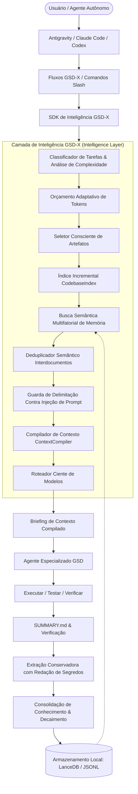

<div align="center">

# GSD-X

**GSD, com um mecanismo de memória e contexto mais inteligente.**

[English](README.md) · **Português** · [简体中文](README.zh-CN.md) · [日本語](README.ja-JP.md) · [한국어](README.ko-KR.md)

GSD reprojetado para uma redução agregada de 67,5% no consumo de tokens em benchmarks, com economias em tarefas individuais atingindo até 83,0%. Memória inteligente, compressão inteligente de contexto, compilação adaptativa de tokens e indexação de código para agentes de codificação de IA de longa duração mais rápidos e eficientes.

[](https://www.fiverr.com/codee_studio)
[](https://www.fiverr.com/codee_studio)
[](https://t.me/kblautosignals)
[](https://www.typescriptlang.org/)
[](tests/)
[](docs/BENCHMARKS.md)
[](LICENSE)

</div>

---

> [!NOTE]
> **Aviso de Fork e Linhagem**: O GSD-X é um fork independente e uma evolução arquitetural do [Open GSD Core](https://github.com/open-gsd/gsd-core). Ele não possui afiliação oficial nem endosso dos mantenedores originais do GSD / Open GSD. O GSD-X preserva total compatibilidade regressiva com os fluxos `.planning/` do upstream, introduzindo uma camada de inteligência de contexto e memória local-first.

---

## O Problema Central: Inchaço de Contexto e Amnésia

Agentes ingênuos de codificação sofrem da **Falácia do Contexto Cumulativo**:

$$\text{Contexto Ingênuo} = \text{Prompt de Sistema} + \text{Histórico de Chat} + \text{Docs de Planejamento} + \text{Memórias Recuperadas} + \text{Arquivos de Código}$$

Essa abordagem acarreta sérios prejuízos:
1. **Ineficiência Brutal de Tokens**: Os custos disparam entre 300% e 500% conforme os projetos crescem.
2. **Degradação de Contexto e Amnésia**: A atenção do modelo se degrada quando saturada com milhares de linhas de especificações irrelevantes.
3. **Deriva de Instruções**: Notas de planejamento antigas entram em conflito com diretrizes ativas de implementação.

### Princípio de Design do GSD-X

> **A MEMÓRIA DEVE SUBSTITUIR O CONTEXTO REDUNDANTE, NÃO APENAS ADICIONAR MAIS CONTEXTO.**

Em vez de concatenar cegamente tudo o que encontra, o GSD-X executa um pipeline determinístico de compilação de contexto:

```
INTENÇÃO DA TAREFA (Task Intent)
    │
    ▼
[Classificador de Tarefas] ──► Avalia a complexidade e aloca orçamento adaptativo de tokens
    │
    ▼
[Filtro de Omissão] ────────► Filtra de 70% a 90% dos documentos de projeto irrelevantes
    │
    ▼
[Indexador de Símbolos] ────► Extrai assinaturas e docstrings de 10 linhas em vez de arquivos de 500 linhas
    │
    ▼
[Mecanismo de Memória] ─────► Injeta decisões destiladas de 25 tokens no lugar de relatórios volumosos
    │
    ▼
[Deduplicador Semântico] ───► Detecta e funde restrições e regras repetidas entre múltiplos arquivos
    │
    ▼
CONTEXTO COMPILADO (Mínimo de tokens, máximo sinal útil)
```

---

## Arquitetura do Sistema



---

## Resultados Medidos em Benchmarks: Até 83,0% Menos Tokens (Empirical Benchmarks)

> **Redução agregada de 67,5% no consumo de tokens em 8 cenários padronizados de desenvolvimento, com economias em tarefas individuais chegando a até 83,0%. Redução medida de custo de 33,0% sob a precificação do Fable 5.**

Todos os números abaixo foram gerados pelo nosso harness de testes automatizado e reproduzível (`benchmarks/run-benchmark.cjs`), comparando diretamente o Open GSD Core original com o GSD-X no commit `13d37238ba08377929e4850fd6ae4b8db49a22ca`. O conjunto de dados canônico está registrado em [`benchmarks/data/benchmark_results.json`](benchmarks/data/benchmark_results.json):

### Detalhamento por Cenário de Desenvolvimento

| Cenário | Baseline GSD Original | Tokens GSD-X | Economia de Tokens | Custo Baseline | Custo GSD-X | Economia de Custo |
|:---|:---:|:---:|:---:|:---:|:---:|:---:|
| **1. Tarefa Simples** (Simple Task) | 2.253 | 382 | **83,0%** | $0,0325 | $0,0138 | **57,5%** |
| **2. Bug Pequeno** (Small Bug) | 2.977 | 592 | **80,1%** | $0,0466 | $0,0227 | **51,2%** |
| **3. Nova Feature** (Feature) | 3.655 | 1.302 | **64,4%** | $0,0806 | $0,0570 | **29,2%** |
| **4. Feature Complexa** (Complex Feature) | 4.954 | 2.146 | **56,7%** | $0,1235 | $0,0955 | **22,7%** |
| **5. Feature Brownfield** (Brownfield Feature) | 3.409 | 1.056 | **69,0%** | $0,0681 | $0,0446 | **34,6%** |
| **6. Conhecimento Repetido** (Repeated Knowledge) | 3.211 | 920 | **71,3%** | $0,0581 | $0,0352 | **39,4%** |
| **7. Projeto Contínuo** (Long-running Project) | 2.665 | 1.341 | **49,7%** | $0,0747 | $0,0614 | **17,7%** |
| **8. Recuperação de Memória** (Memory Recall) | 2.358 | 549 | **76,7%** | $0,0376 | $0,0195 | **48,1%** |
| **TOTAL AGREGADO** | **25.482** | **8.288** | **67,5%** | **$0,5216** | **$0,3497** | **33,0%** |

*Modelo de Preços: Fable 5 ($10,00/1M entrada, $50,00/1M saída). Todos os cálculos são derivados de dados não arredondados. O custo total baseline não arredondado é $0,52162 (exibido como $0,5216); o custo total do GSD-X não arredondado é $0,34968 (exibido como $0,3497). Devido ao arredondamento para 4 casas decimais (+0,00008 acumulado), a soma das exibições individuais resulta em $0,5217 no baseline.*

### Como Calculamos a Economia

```text
REDUÇÃO DE TOKENS
Tokens de Referência: 25.482 (18.812 entrada + 6.670 saída)
Tokens GSD-X:          8.288 (1.618 entrada + 6.670 saída)
Tokens Economizados:  17.194
Redução Agregada de Tokens = (25.482 − 8.288) ÷ 25.482 × 100 = 67,475% ≈ 67,5%

REDUÇÃO DE CUSTO (Fable 5: $10/M entrada, $50/M saída)
Custo Baseline: (18.812 × $10 ÷ 1M) + (6.670 × $50 ÷ 1M) = $0,18812 + $0,33350 = $0,52162
Custo GSD-X:    (1.618 × $10 ÷ 1M) + (6.670 × $50 ÷ 1M)  = $0,01618 + $0,33350 = $0,34968
Custo Líquido Economizado: $0,52162 − $0,34968 = $0,17194
Economia de Custo = ($0,52162 − $0,34968) ÷ $0,52162 × 100 = 32,963% ≈ 33,0%

Por que a Redução de Tokens (67,5%) ≠ Economia de Custo (33,0%)?
No Fable 5, tokens de saída custam 5× mais que tokens de entrada ($50/M vs $10/M).
O GSD-X elimina contexto redundante de entrada (especificações, mapas, resumos históricos),
enquanto o código de saída de alta qualidade gerado pelo modelo (6.670 tokens) permanece idêntico.
Como os tokens de saída representam 64% do custo total da linha de base, a economia financeira
real é de 33,0%, mesmo com a redução de 67,5% no volume total de tokens.
```

### Impacto em Escala: Carga de Trabalho Baseline vs. GSD-X Equivalente (Scale Projections)

Projeções proporcionais mantendo a proporção de 73,8% entrada / 26,2% saída da linha de base:

| Métrica | Carga de Trabalho Baseline | Carga Equivalente GSD-X | Economia Líquida com GSD-X |
|:---|:---:|:---:|:---:|
| **1M Tokens Baseline** | 1.000.000 tokens | 325.249 tokens | **674.751 tokens economizados (redução de 67,5%)** |
| **Custo Fable 5 (1M)** | $20,47 | $13,72 | **$6,75 economizados a cada 1M tokens (redução de 33,0%)** |
| **Em 10M Tokens Baseline** | 10.000.000 tokens ($204,70) | 3.252.492 tokens ($137,23) | **6.747.508 tokens eliminados \| $67,47 economizados** |
| **Em 100M Tokens Baseline**| 100.000.000 tokens ($2.046,99) | 32.524.920 tokens ($1.372,26) | **67.475.080 tokens eliminados \| $674,73 economizados** |

*Nota: Os valores de escala utilizam extrapolação linear exata a partir de dados não arredondados ($20,4699 baseline e $13,7226 GSD-X por 1M de tokens). A multiplicação direta dos valores arredondados ($20,47, $13,72, $6,75) resulta em $204,70 / $137,20 / $67,50 em 10M e $2.047,00 / $1.372,00 / $675,00 em 100M.*

---

## Principais Funcionalidades

### 1. Sistema de Memória Semântica Local-First
- **Armazenamento de Backend Duplo**: Motor vetorial embutido [LanceDB](https://lancedb.github.io/lancedb/) sem servidores externos, emparelhado com fallback instantâneo de zero dependências em JSONL (`JsonMemoryStore`).
- **Embeddings Determinísticos de 128 Dimensões**: Hashing leve de atributos offline (`LocalHashEmbeddingProvider`) que elimina dependência de APIs externas de embeddings e garante total privacidade.
- **Pontuação Multifatorial de Candidatos**: Classifica memórias combinando similaridade semântica, isolamento de projeto, relevância de fase, níveis de autoridade, decaimento temporal e frequência de acesso.
- **Hierarquia Estrita de Autoridade**: `authoritative` > `verified` > `high-confidence` > `learned` > `inferred` > `experimental`, garantindo que palpites não sobrescrevam decisões consolidadas.
- **Decaimento Temporal com Proteção**: O conhecimento volátil decai naturalmente (meia-vida de 30 dias), enquanto diretrizes arquiteturais autoritativas **nunca decaem**.

### 2. Compilador de Contexto Inteligente
- **Orçamentos Adaptativos de Tokens**: Distribui dinamicamente o volume de tokens conforme o porte da tarefa (de 3.500 para tarefas triviais a 32.000 para refatorações profundas).
- **Seleção e Omissão Consciente**: Varre `.planning/` e mapas de código, omitindo artefatos irrelevantes e documentando justificativas no manifesto de auditoria.
- **Deduplicação Semântica Interdocumentos**: Consolida regras de código e restrições técnicas declaradas repetidamente em vários arquivos markdown, economizando de 15% a 30% em tokens.
- **Defesa Contra Injeção de Prompt**: Todas as memórias recuperadas são encapsuladas em tags `<retrieved-memory>` com contrato operacional que neutraliza instruções maliciosas.

### 3. Inteligência de Código Incremental (`CodebaseIndex`)
- **Indexação Incremental de Símbolos**: Cacheia timestamps de modificação (`mtime`) e hashes SHA-256 para analisar apenas arquivos alterados.
- **Extração de Assinaturas e Docstrings**: Injeta apenas as 5 a 10 linhas essenciais de assinaturas em vez de carregar arquivos completos de 500 linhas.
- **Suporte Multilinguagem**: Compatibilidade nativa com TypeScript, JavaScript e Python.

### 4. Roteamento Ciente de Modelos
- **Roteamento por Complexidade**: Direciona cada solicitação para a camada ideal de modelo (`cheapModel`, `fastModel`, `strongCodingModel`, `reasoningModel`, `auditModel`).
- **Fallback Confiável**: Recua para o perfil de modelo padrão do ambiente caso o roteamento dinâmico esteja desativado.

---

## Comparativo: GSD-X vs. Alternativas

| Dimensão | RAG Comum / Mem0 | RuFlo / Claude Flow | Open GSD Core | **GSD-X** |
|:---|:---:|:---:|:---:|:---:|
| **Paradigma** | Memória conversacional | Orquestração em enxame | Fases guiadas por specs | **Fases guiadas + Memória Inteligente** |
| **Estratégia de Contexto** | Aditiva (mais tokens) | Contexto cumulativo | Leitura manual de arquivos | **Subtrativa (memória substitui documentos)** |
| **Otimização de Tokens** | ❌ Nenhuma | ❌ Alto consumo | ⚠️ Apenas novos contextos | ✅ **Orçamento adaptativo + economia de 67,5%** |
| **Deduplicação** | ❌ Nenhuma | ❌ Nenhuma | ❌ Nenhuma | ✅ **Deduplicação semântica interdocumentos** |
| **Consciência de Código** | ❌ Pedaços brutos de texto | ⚠️ Apenas listagem | ⚠️ Busca manual com grep | ✅ **Indexador incremental de assinaturas** |
| **Armazenamento** | Nuvem SaaS / Redis | Malha distribuída | Nenhum (.planning/ apenas) | ✅ **Local-first LanceDB + JSONL** |
| **Segurança e Privacidade** | Risco de exfiltração | Dados externos não isolados | Arquivos locais | ✅ **Tags de contenção + mascaramento de segredos** |
| **Compatibilidade** | N/A | N/A | Linha de base | ✅ **100% compatível com `.planning/`** |

---

## Início Rápido

### Instalação e Compilação

```bash
# Clonar o repositório
git clone https://github.com/udaydeep1992/gsd-x.git
cd gsd-x
git checkout gsd-x

# Instalar dependências e compilar o SDK
npm install
npm run build:sdk
```

### Execução de Testes e Benchmarks

```bash
# Rodar suíte completa de testes (41/41 passando em 6 subsistemas)
npm run test:sdk

# Executar medição reproduzível de economia de tokens e custos
npm run benchmark
```

### Comandos de Linha de Comando (CLI)

O GSD-X opera de forma totalmente integrada com a CLI `gsd-tools`:

```bash
# Diagnosticar a integridade da memória e verificar vazamento de segredos
node gsd-core/bin/gsd-tools.cjs memory doctor

# Registrar uma decisão de arquitetura na memória persistente
node gsd-core/bin/gsd-tools.cjs memory add "Adotado PostgreSQL 16 com chaves primárias UUIDv4" --type decision --tags db,postgres

# Busca vetorial semântica nas memórias do projeto
node gsd-core/bin/gsd-tools.cjs memory search "decisões de banco de dados" --limit 5

# Exibir detalhes de um registro específico de memória
node gsd-core/bin/gsd-tools.cjs memory show <memory-id>

# Exibir estatísticas de armazenamento de memória
node gsd-core/bin/gsd-tools.cjs memory stats

# Inspecionar orçamento de tokens, artefatos omitidos e economia de deduplicação
node gsd-core/bin/gsd-tools.cjs context stats --task "Refatorar middleware de autenticação"
```

---

## Documentação Técnica

- 🧠 **[Memória Semântica Local-First (MEMORY.md)](docs/MEMORY.md)**: Análise detalhada de LanceDB, hash de embeddings, ranking multifatorial, hierarquia de autoridade e decaimento.
- ⚡ **[Compilador de Contexto (CONTEXT-COMPILER.md)](docs/CONTEXT-COMPILER.md)**: Detalhes do pipeline de 8 estágios, deduplicação e imposição de orçamento de tokens.
- 📊 **[Otimização de Tokens (TOKEN-OPTIMIZATION.md)](docs/TOKEN-OPTIMIZATION.md)**: As cinco alavancas de redução de tokens e análise empírica de impacto.
- 🪐 **[Integração com Google Antigravity (ANTIGRAVITY.md)](docs/ANTIGRAVITY.md)**: Guia completo para uso dentro do Antigravity com slash commands e subagentes.
- 📈 **[Metodologia de Benchmarks e Dados (BENCHMARKS.md)](docs/BENCHMARKS.md)**: Definições de cenários, medições brutas e passos para reprodução.
- 🛡️ **[Arquitetura de Segurança e Privacidade (SECURITY.md)](docs/SECURITY.md)**: Blindagem contra injeção de prompt, redação de credenciais e isolamento local.
- 🔄 **[Guia de Migração (MIGRATION.md)](docs/MIGRATION.md)**: Atualização suave a partir do Open GSD Core, GSD v1 e GSD v2 sem quebra de compatibilidade.

---

## Mantenedor e Suporte Comercial

O GSD-X é ativamente desenvolvido e mantido pelo **Codee Studio**.

[](https://www.fiverr.com/codee_studio)
[](https://www.fiverr.com/codee_studio)
[](https://t.me/kblautosignals)

Se você precisa de arquiteturas customizadas de agentes de IA, integração de fluxos de desenvolvimento automatizados, adaptação de memória corporativa ou tooling de alta performance:
- 💼 **Contrate no Fiverr**: [fiverr.com/codee_studio](https://www.fiverr.com/codee_studio) —— Engenharia especializada em agentes autônomos, integrações de runtime e ferramentas sob medida.
- 💬 **Suporte Direto via Telegram**: [@kblautosignals](https://t.me/kblautosignals) —— Canal rápido para consultas técnicas e parcerias de engenharia.

---

## Licença

MIT © [OpenGSD](https://github.com/open-gsd) e Contribuidores do GSD-X.
